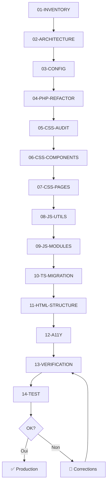

# 🤖 Agents de Refactoring - Grande Maison

Ce dossier contient les instructions pour 14 agents spécialisés qui vont refactoriser le site Grande Maison de manière coordonnée.

## 🎯 Objectif du Refactoring

Transformer le code actuel (~10 500 lignes monolithiques) en une architecture moderne :
- ✅ TypeScript au lieu de JavaScript vanilla
- ✅ Modules ES au lieu d'un fichier monolithique  
- ✅ CSS modulaire au lieu d'un fichier de 3000 lignes
- ✅ API PHP organisée avec gestion d'erreurs
- ✅ HTML sémantique et accessible

## 📋 Liste des Agents

| # | Agent | Rôle | Durée estimée |
|---|-------|------|---------------|
| 00 | ORCHESTRATOR | Coordonne tous les agents | - |
| 01 | INVENTORY | Cartographie exhaustive du code | 1-2h |
| 02 | ARCHITECTURE | Crée la nouvelle structure | 30min |
| 03 | CONFIG | Setup TypeScript + Vite | 30min |
| 04 | PHP-REFACTOR | Réorganise le backend | 2-3h |
| 05 | CSS-AUDIT | Analyse et plan CSS | 1h |
| 06 | CSS-COMPONENTS | Extrait les composants CSS | 2-3h |
| 07 | CSS-PAGES | Extrait les CSS de pages | 1h |
| 08 | JS-UTILS | Crée les utilitaires TS | 1h |
| 09 | JS-MODULES | Découpe en modules | 3-4h |
| 10 | TS-MIGRATION | Finalise TypeScript | 2h |
| 11 | HTML-STRUCTURE | Refactoring HTML | 1-2h |
| 12 | A11Y | Accessibilité | 1-2h |
| 13 | VERIFICATION | Contrôle qualité | Continu |
| 14 | TEST | Tests finaux | 2h |

**Durée totale estimée : 15-20 heures**

## 🚀 Comment Utiliser

### Démarrer le Refactoring

```
Lis le fichier .agents/00-ORCHESTRATOR.md et commence le refactoring 
en suivant l'ordre défini. Commence par l'agent 01-INVENTORY.
```

### Exécuter un Agent Spécifique

```
Lis le fichier .agents/XX-NOM-AGENT.md et exécute toutes les tâches décrites.
Quand tu as terminé, mets à jour le status dans 00-ORCHESTRATOR.md
```

### Vérification après Changements

```
Exécute les vérifications décrites dans .agents/13-VERIFICATION-AGENT.md
pour le code qui vient d'être modifié.
```

## 📁 Structure des Fichiers

```
.agents/
├── 00-ORCHESTRATOR.md      # Chef d'orchestre
├── 01-INVENTORY-AGENT.md   # Inventaire du code
├── 02-ARCHITECTURE-AGENT.md # Structure dossiers
├── 03-CONFIG-AGENT.md      # Setup tooling
├── 04-PHP-REFACTOR-AGENT.md # Backend PHP
├── 05-CSS-AUDIT-AGENT.md   # Analyse CSS
├── 06-CSS-COMPONENTS-AGENT.md # Composants CSS
├── 07-CSS-PAGES-AGENT.md   # CSS pages
├── 08-JS-UTILS-AGENT.md    # Utilitaires TS
├── 09-JS-MODULES-AGENT.md  # Modules JS
├── 10-TS-MIGRATION-AGENT.md # Migration TS
├── 11-HTML-STRUCTURE-AGENT.md # HTML sémantique
├── 12-A11Y-AGENT.md        # Accessibilité
├── 13-VERIFICATION-AGENT.md # QA
├── 14-TEST-AGENT.md        # Tests finaux
├── README.md               # Ce fichier
├── INVENTORY.md            # (Généré par agent 01)
└── CSS-AUDIT-REPORT.md     # (Généré par agent 05)
```

## ⚠️ Règles Importantes

1. **Toujours commencer par l'inventaire** (Agent 01)
2. **Un agent à la fois** dans l'ordre défini
3. **Vérifier après chaque agent** (Agent 13)
4. **Ne pas supprimer l'ancien code** tant que le nouveau n'est pas validé
5. **Committer après chaque agent** terminé

## 🔄 Workflow Type



## 📊 Tracking Progress

Utilise cette checklist pour suivre l'avancement :

```markdown
- [ ] Phase 0 : Inventaire
  - [ ] 01-INVENTORY ✅
  
- [ ] Phase 1 : Fondations
  - [ ] 02-ARCHITECTURE
  - [ ] 03-CONFIG
  
- [ ] Phase 2 : Backend
  - [ ] 04-PHP-REFACTOR
  
- [ ] Phase 3 : CSS
  - [ ] 05-CSS-AUDIT
  - [ ] 06-CSS-COMPONENTS
  - [ ] 07-CSS-PAGES
  
- [ ] Phase 4 : JavaScript
  - [ ] 08-JS-UTILS
  - [ ] 09-JS-MODULES
  - [ ] 10-TS-MIGRATION
  
- [ ] Phase 5 : HTML
  - [ ] 11-HTML-STRUCTURE
  - [ ] 12-A11Y
  
- [ ] Phase 6 : Validation
  - [ ] 13-VERIFICATION
  - [ ] 14-TEST
```

## 💡 Tips

- **Sauvegardes** : Git commit après chaque agent
- **Tests** : Tester le site après chaque modification
- **Documentation** : Chaque agent documente ses changements
- **Patience** : C'est un gros refactoring, prendre le temps de bien faire

---

*Créé pour le projet Grande Maison - Migration v2.0*
